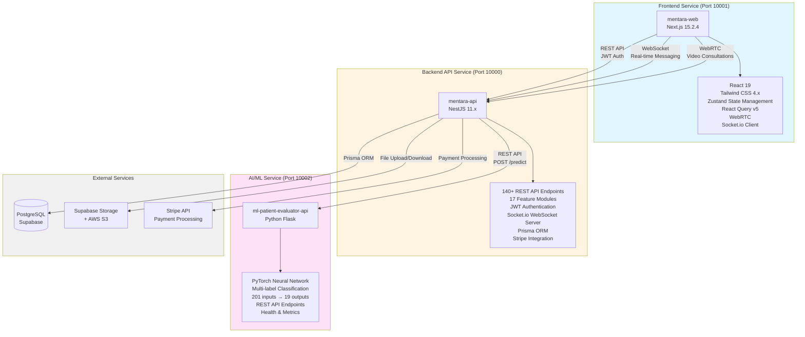
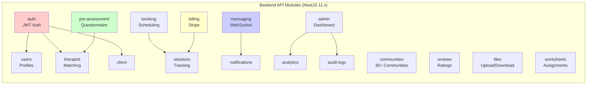
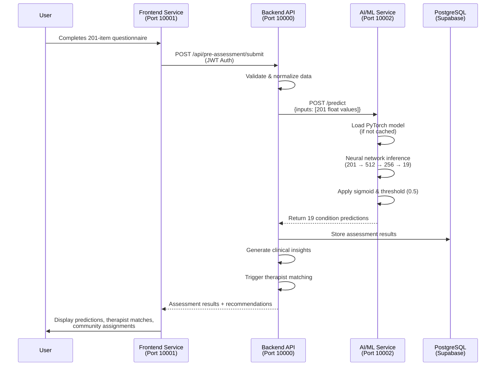

# System Architecture

## 3. System Architecture

### 3.1 Overview

Mentara implements a production-ready microservices architecture designed for scalability, maintainability, and independent deployment. The system comprises three core services, each with distinct responsibilities and clear service boundaries. This architecture enables independent scaling of services based on demand, particularly important for computationally intensive AI/ML inference workloads.

### 3.2 Microservices Architecture

The platform consists of three independently deployable services:



**Figure 1: Mentara microservices architecture showing three independently deployable services (Frontend, Backend API, AI/ML) integrated through standardized REST APIs.**

### 3.3 Frontend Service (mentara-web)

**Technology Stack**:
- **Framework**: Next.js 15.2.4 with App Router and TypeScript
- **UI Library**: React 19 with Tailwind CSS 4.x
- **Component Library**: shadcn/ui built on Radix UI primitives
- **State Management**: Zustand (client state) + React Query v5 (server state)
- **Real-time**: Socket.io client for messaging, WebRTC for video calls

**Key Responsibilities**:
- User interface for all user types (Client, Therapist, Moderator, Admin)
- Authentication flow with JWT token management
- 201-item mental health questionnaire interface
- Real-time messaging and video consultation interfaces
- Therapist matching and booking interfaces
- Community platform interface

**Assessment Interface Architecture**:
```
app/(protected)/assessment/
├── questionnaire/         # Multi-section questionnaire form
├── progress-tracking/     # Real-time completion progress
├── results-display/       # AI prediction visualization
└── therapist-matching/    # AI-recommended therapists
```

### 3.4 Backend API Service (mentara-api)

**Technology Stack**:
- **Framework**: NestJS 11.x with TypeScript
- **Database**: PostgreSQL via Supabase with Prisma ORM
- **Authentication**: JWT with bcrypt password hashing
- **Real-time**: Socket.io WebSocket server
- **Payment**: Stripe API integration

**Module Architecture** (17 modules, 140+ endpoints):



**Directory Structure**:

```
mentara-api/src/
├── auth/              # JWT authentication, login, registration
├── users/             # User profile management
├── therapist/         # Therapist profiles, verification, matching
├── client/            # Client-specific functionality
├── communities/        # 30+ mental health communities
├── messaging/         # Real-time messaging (WebSocket)
├── booking/           # Session scheduling
├── pre-assessment/    # Mental health questionnaire integration
├── reviews/           # Therapist rating system
├── files/             # File upload and management
├── billing/           # Stripe payment processing
├── admin/             # Administrative dashboard
├── sessions/          # Therapy session tracking
├── worksheets/        # Therapy assignment management
├── notifications/     # User notification system
├── analytics/         # Usage analytics
└── audit-logs/        # System audit trail
```

**Pre-Assessment Module Integration**:
The pre-assessment module serves as the integration point between the frontend questionnaire and the AI/ML service:

```typescript
src/pre-assessment/
├── pre-assessment.controller.ts    # Assessment endpoints
├── ai-service-client.service.ts    # ML service HTTP client
├── assessment-results.service.ts    # Results processing
└── therapist-matching.service.ts    # AI-powered matching
```

### 3.5 AI/ML Service Architecture (ml-patient-evaluator-api)

**Technology Stack**:
- **Framework**: Python Flask with REST API design
- **Machine Learning**: PyTorch neural network
- **Model Architecture**: Multi-label classification (201 inputs → 19 outputs)
- **Containerization**: Docker with Python 3.11

**Service Structure**:
```
ml-patient-evaluator-api/
├── api.py                      # Flask app entry point
├── src/
│   ├── app.py                  # Flask factory and security headers
│   ├── routes/
│   │   ├── predict.py         # Prediction endpoint
│   │   ├── health.py          # Health check endpoint
│   │   └── metrics.py         # Performance metrics
│   ├── services/
│   │   ├── inference_service.py  # Model loading and inference
│   │   └── state.py            # Service state management
│   ├── models/
│   │   └── multilabel_nn.py   # PyTorch model definition
│   └── security/
│       └── security.py        # Security headers
└── models/
    └── mental_model_config2.pt  # Trained model weights
```

**API Endpoints**:
- `POST /predict`: Accepts 201-item questionnaire array, returns 19 condition predictions
- `GET /health`: Service health status and model availability
- `GET /metrics`: Performance metrics (request count, latency, success rate)
- `POST /metrics/reset`: Reset metrics counters

### 3.6 Data Flow Architecture

**Assessment Flow**:



**Text Flow**:

```
1. User completes 201-item questionnaire (Frontend)
   ↓
2. Frontend sends responses to Backend API
   POST /api/pre-assessment/submit
   ↓
3. Backend validates and normalizes data
   ↓
4. Backend calls AI/ML Service
   POST http://ml-service:10002/predict
   Body: { "inputs": [201 float values] }
   ↓
5. AI/ML Service performs inference
   - Load model (if not cached)
   - Run forward pass through neural network
   - Apply sigmoid activation and threshold (0.5)
   - Return 19 boolean predictions
   ↓
6. Backend processes results
   - Store assessment results in database
   - Generate clinical insights
   - Trigger therapist matching algorithm
   ↓
7. Frontend displays results
   - Condition predictions with confidence scores
   - Therapist recommendations
   - Community assignments
```

**Therapist Matching Integration**:

The AI assessment results inform a sophisticated therapist matching algorithm:

```typescript
// Simplified matching flow
1. Extract predicted conditions from AI assessment
2. Build user condition profile
3. Calculate compatibility scores for each therapist:
   - Condition match score (specialization alignment)
   - Approach compatibility (therapy method fit)
   - Experience and success score
   - Review and rating score
   - Logistics score (availability, location)
4. Rank therapists by weighted total score
5. Return top recommendations with explanations
```

### 3.7 Neural Network Architecture

**Model Architecture**:
```
Input Layer:     201 neurons (questionnaire responses)
    ↓
Hidden Layer 1:  512 neurons + ReLU activation + Dropout (0.4)
    ↓
Hidden Layer 2:  256 neurons + ReLU activation + Dropout (0.4)
    ↓
Output Layer:    19 neurons + Sigmoid activation
    ↓
Threshold:       0.5 (binary classification per condition)
```

**Architecture Details**:
- **Input Size**: 201 features (one per questionnaire item)
- **Hidden Layers**: 2 fully connected layers (512 → 256 neurons)
- **Activation Functions**: ReLU for hidden layers, Sigmoid for output
- **Regularization**: Dropout (0.4) after each hidden layer
- **Output Size**: 19 binary predictions (one per mental health condition)
- **Loss Function**: Binary Cross-Entropy (multi-label classification)

**Model Parameters**:
- Total parameters: ~150,000 trainable parameters
- Model size: ~600 KB (compressed PyTorch state dict)
- Inference mode: CPU-optimized (GPU support available)

### 3.8 Scalability and Deployment

**Containerization Strategy**:
Each service has its own Docker container and docker-compose configuration:

```yaml
# Service-specific deployment
mentara-api/docker-compose.yml      # Backend API
mentara-web/docker-compose.yml      # Frontend
ml-patient-evaluator-api/docker-compose.yml  # AI/ML Service
```

**Scaling Considerations**:
- **Frontend**: Stateless, horizontally scalable via load balancer
- **Backend API**: Stateless API layer, scales horizontally with shared database
- **AI/ML Service**: Can scale independently based on inference demand
- **Database**: PostgreSQL via Supabase with connection pooling

**Performance Characteristics**:
- **API Response Time**: <200ms (p95) for standard endpoints
- **AI Inference Time**: <1000ms average, <2000ms maximum
- **Concurrent Requests**: Supports multiple simultaneous predictions
- **Model Loading**: Lazy loading on first request, cached in memory

### 3.9 Integration Patterns

**REST API Communication**:
- Backend → AI/ML Service: Synchronous HTTP POST requests
- Frontend → Backend: RESTful API calls with JWT authentication
- Error handling: Graceful degradation if AI service unavailable

**Real-time Communication**:
- WebSocket connections for messaging and notifications
- WebRTC peer-to-peer connections for video consultations
- Socket.io namespaces for different communication types

**Data Persistence**:
- Assessment results stored in PostgreSQL database
- Model predictions cached to reduce redundant inference
- Audit logging for compliance and debugging

---

## Notes for Authors

- Add detailed sequence diagrams for data flow
- Include network topology diagrams
- Expand on error handling and retry logic
- Add deployment architecture diagrams
- Include performance benchmarks and scaling metrics
- Document API contracts and data schemas
